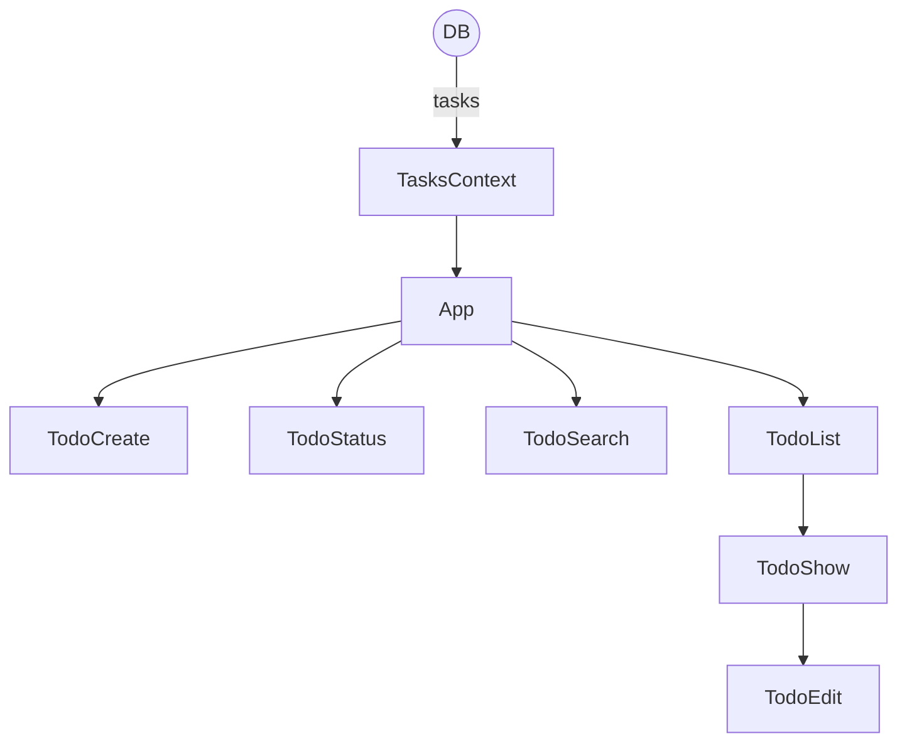

# How to start a project

### 1) Скачайте архив с репозиторием на свой ПК

### 2) Откройте папку с репозиторием в новом окне терминала и установите все зависимости 

### `npm install`

### 3) Запустите backend сервер в первом окне терминала

### `npm run server`

### 4) Запустите сам проект во втором втором окне терминала

### `npm run start`

 

# About project

Обновленная версия [Чеклиста](https://github.com/itsonlythebeginning/todo-react-v1/) представляющего собой список дел

> Это вторая версия приложения
> 
> В этой версии приложения все данные хранятся на backend сервере (json server)

## Functions

Дела можно:
- [x] Добавлять
- [x] Изменять
- [x] Удалять
- [x] Отмечать сделанными
- [x] Сортировать по статусу выполнения
- [x] Искать нужное дело через поиск
- [x] Отслеживать через счетчик кол-во активных/выполенных дел
- [ ] Перемещать

## 

##

